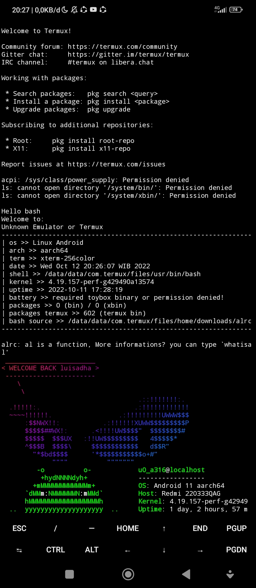
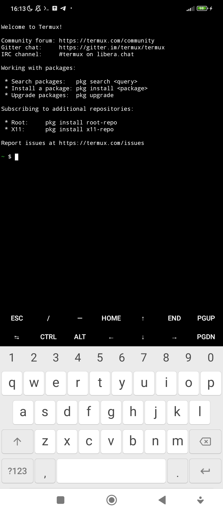
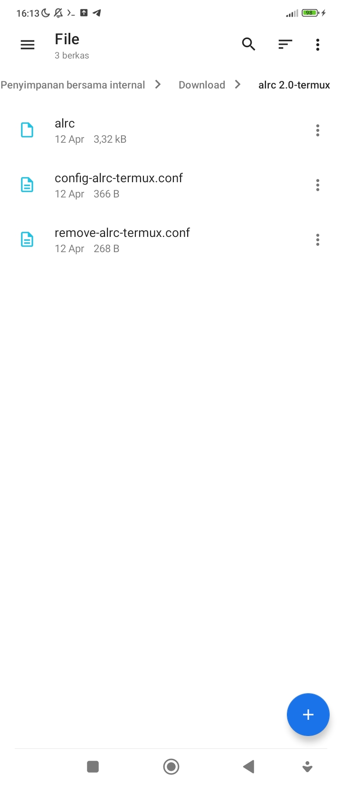
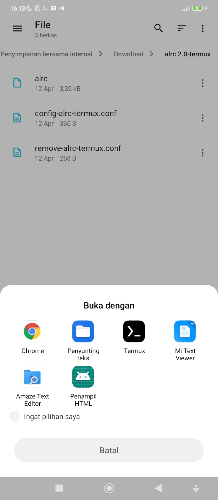
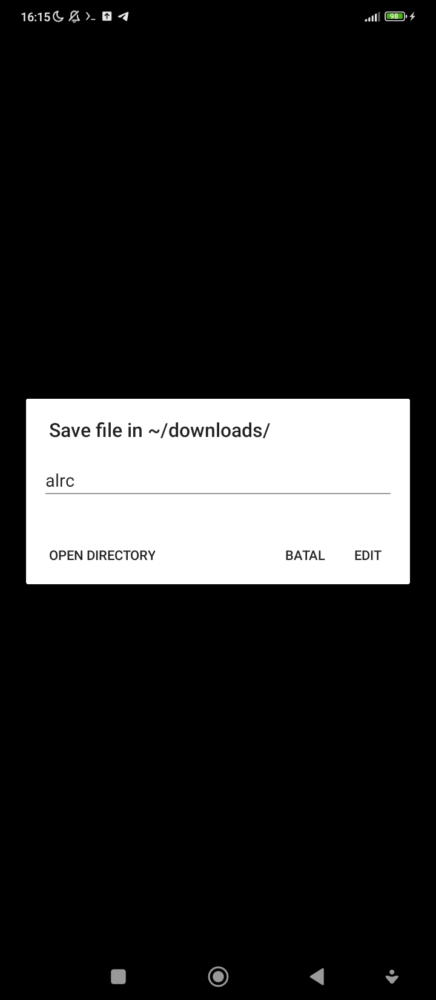
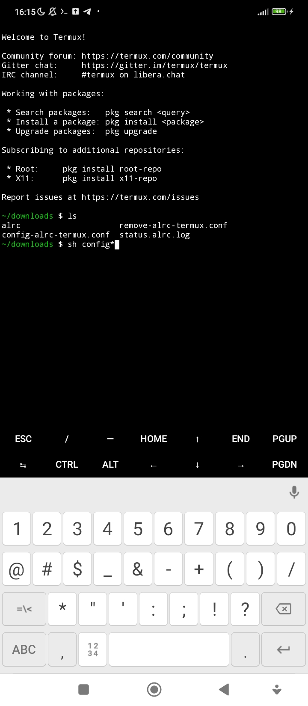
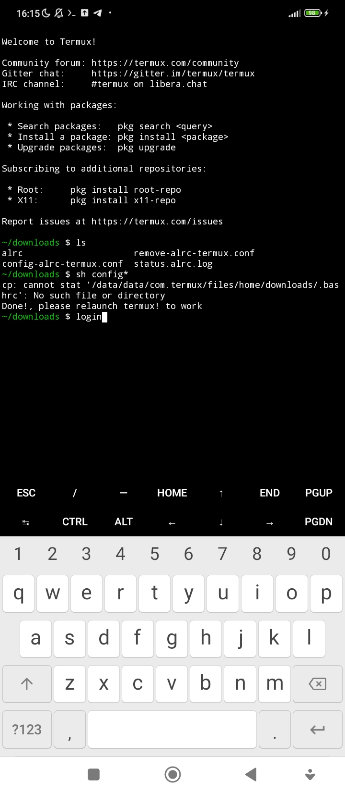

# $HOME/downloads/alrc

al function for termux called alrc-termux
## Instalation without changing motd

Copy raw profile at this repo and `nano /data/data/com.termux/files/usr/etc/profile`
Select all and paste it, CTRL+X, Y, Enter.

## Instalation changing motd

* Step 0

* Step 1

* Step 2

* Step 3

* Step 4

* Step 5

* Step 6 atau terakhir

 You successfully installed motd from me or bashrc

Install 
> cowsay, figlet, lolcat, and neofetch when necessary 

